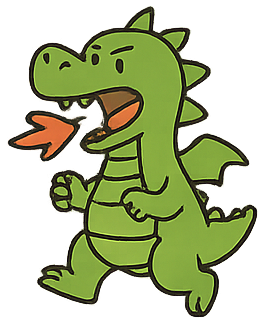
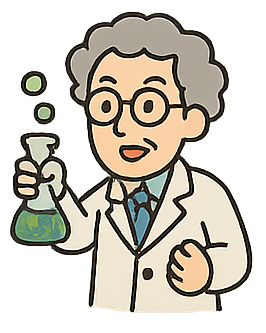
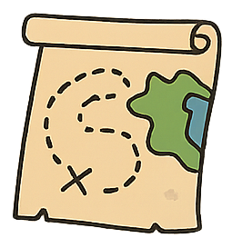
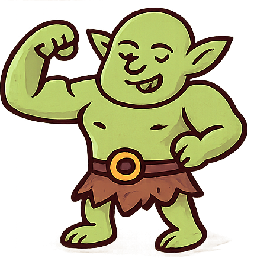
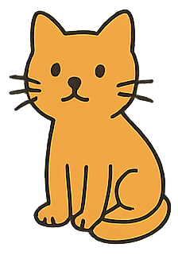

นางสาวอรจิรา รอดกลึง 6809650135  
นางสาวพิชญาภา ชูศฐานนท์ 6809650051  
นางสาวปภาดา สัมฤทธิ์ 6809650259  
นางสาววรัทยา สระแก้ว 6809650325  
นางสาวกรรวี ลิมปิกาญจนโกวิท 6809650341 
นายธาวิน กันทะสา 6809650242 

# Team Story Challenge

This is the starting draft of your team’s story.  
Your mission: **revise and improve it**, making it coherent, funny, and illustrated with the provided images.

---

## Our Wonderful Story

1. Once upon a time, there was a **castle**.  
   
2. Then suddenly, a **dragon** appeared… but maybe it was actually a **robot**?  
   

3. The scientist's **crucial announcement** was, regrettably, **not recorded**.  

4. After that, everyone got lost (or maybe teleported?) and somehow there was a **treasure chest**…  
   

5. Someone found a map, but it had no directions.  
    

6. “Let’s go to space!” shouted the shrek.
   

7. A rocket blasted off, but at the same time the **time machine** broke down. 
    

8. The cat was supposed to talk here, but the line is missing.
   

9. In the forest, the detective discovered… something.  
   (What did they find?)
   

10. the eiei
